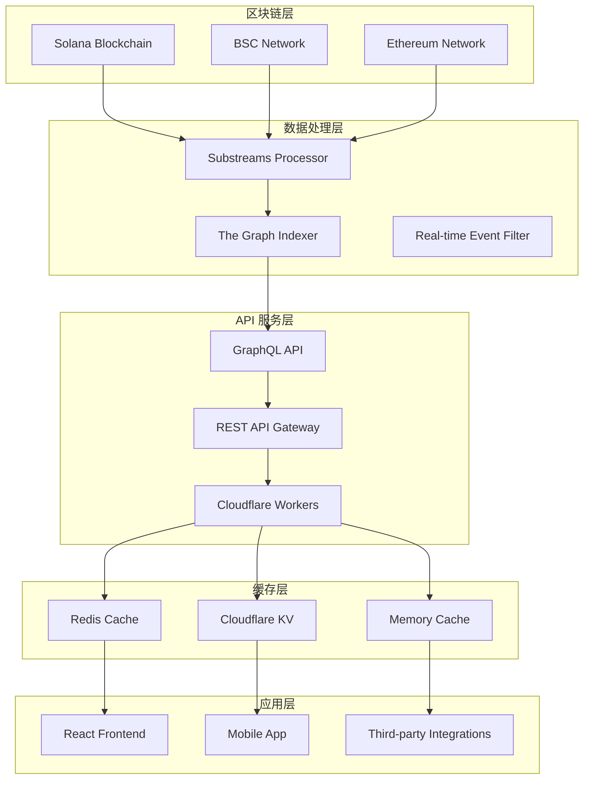

# Mars Liquid - 跨链 DeFi 流动性聚合协议

Mars Liquid 是一个综合性的跨链 DeFi 协议，集成了 DEX 交易、流动性挖矿、收益聚合和 Solana 智能合约等功能。项目采用现代化的全栈架构，支持多链生态系统，为用户提供一站式的 DeFi 服务。

## 🌟 核心特性

- **🔄 跨链 DEX 交易**: 支持 Solana、BSC、Ethereum 等主流区块链的代币交易
- **💰 收益聚合**: 通过 Kamino Earn 和 Jupiter Lend 集成实现自动化收益优化
- **🏊 流动性管理**: 提供集中式和去中心化的流动性池管理
- **📊 实时分析**: 完整的交易数据分析和用户行为追踪
- **🤖 AI 智能服务**: 代码生成、交易建议和风险评估
- **⚡ 高性能后端**: 基于 Cloudflare Workers 的无服务器架构
- **🎨 现代化前端**: React 19 + Material-UI v7 构建的响应式界面

## 🏗️ 项目架构

### 整体架构图

```
Mars Liquid 生态系统
├── 🌐 Frontend (React 19)          # 用户界面层
│   ├── DeFi 交易界面              
│   ├── 多链钱包集成
│   └── 实时数据展示
│
├── ⚡ Backend (Cloudflare Workers)  # API 服务层
│   ├── DEX 交易引擎
│   ├── 数据库服务
│   ├── AI 智能服务
│   └── 缓存优化
│
├── 🔗 Smart Contracts (Solana)      # 区块链层
│   ├── Mars Vault 合约
│   ├── Kamino CPI 集成
│   └── Jupiter 协议集成
│
├── 📊 Data Infrastructure           # 数据层
│   ├── Substreams 数据处理
│   ├── The Graph 索引
│   └── GraphQL API
│
└── 🔧 DevOps & Tools               # 开发工具
    ├── 自动化部署
    ├── 测试套件
    └── 监控告警
```

### 核心组件详解

```
mars-projects/
├── frontend/                       # 前端应用 (React 19 + Material-UI v7)
│   ├── src/
│   │   ├── components/            # UI 组件
│   │   ├── pages/                 # 页面路由
│   │   ├── hooks/                 # React Hooks
│   │   ├── services/              # API 服务
│   │   └── dex/                   # DEX 集成
│   └── package.json
│
├── backend/                        # 后端服务 (Cloudflare Workers)
│   ├── src/
│   │   ├── dex/                   # DEX 交易引擎
│   │   ├── mars/                  # Mars 协议服务
│   │   ├── database/              # 数据库层
│   │   ├── cache/                 # 缓存系统
│   │   └── mcp/                   # MCP 协议支持
│   ├── indexer/                   # The Graph 子图
│   └── scripts/                   # 部署脚本
│
├── mars-contracts-solana/          # Solana 智能合约
│   ├── programs/mars/             # 主合约程序
│   │   ├── src/
│   │   │   ├── lib.rs            # 程序入口
│   │   │   ├── instructions/     # 指令集
│   │   │   └── state/            # 状态管理
│   │   └── Cargo.toml
│   ├── cli/                       # 命令行工具
│   ├── tests/                     # 测试套件
│   └── lib/                       # 工具库
│
└── substreams/                     # 区块链数据流处理
    ├── src/                       # Rust 处理器
    ├── proto/                     # Protocol Buffers
    └── schema.graphql             # GraphQL 模式
```

## 💻 技术栈

### 前端技术
- **React 19**: 最新的并发特性和增强渲染性能
- **TypeScript**: 全栈类型安全保障
- **Material-UI v7**: 现代化的设计系统和组件库
- **Vite**: 闪电般的构建工具和热更新
- **React Router v7**: 最新的路由和数据加载能力

### 区块链集成
- **Solana**: @solana/web3.js v1.98, wallet-adapter 生态
- **EVM 兼容**: wagmi v2.12, viem v2.21 支持以太坊生态
- **多钱包支持**: Phantom, MetaMask, WalletConnect 等
- **Anchor Framework**: Solana 智能合约开发框架

### 后端服务
- **Cloudflare Workers**: 无服务器边缘计算
- **Drizzle ORM**: 类型安全的数据库操作
- **D1 数据库**: Cloudflare 的分布式数据库
- **KV 存储**: 高性能键值对缓存
- **R2 对象存储**: 文件存储和 CDN 加速

### 数据基础设施
- **Substreams**: 实时区块链数据处理
- **The Graph Protocol**: 去中心化的数据索引
- **GraphQL**: 高效的数据查询接口
- **REST API**: 传统 HTTP API 支持

## 🚀 核心功能

### 1. 跨链 DEX 交易
- **多链支持**: Solana, BSC, Ethereum, Polygon, Avalanche
- **实时价格数据**: WebSocket 和 REST API 价格源
- **智能路由**: 自动寻找最佳交易路径
- **滑点保护**: 防止价格滑点损失
- **交易历史**: 完整的用户交易记录和分析

### 2. 流动性挖矿和收益聚合
- **Kamino Earn 集成**: 通过 CPI 调用实现自动化收益优化
- **Jupiter Lend 协议**: 多协议收益农场策略
- **动态再平衡**: 自动调整资产分配以最大化收益
- **复利机制**: 自动重新投资和复利计算
- **风险管理**: 智能风险评估和分散化指标

### 3. 智能合约 CPI 集成

#### Mars Vault 智能合约示例

```rust
// Mars Vault 主合约 - 支持多协议收益聚合
use anchor_lang::prelude::*;

declare_id!("5Yxrh62n36maX6u8nePs2ztWfKTWA9pJLXCNd1tzo1kP");

#[program]
pub mod mars {
    use super::*;
    
    // 存款到 Kamino Vault
    pub fn deposit_to_kamino(
        ctx: Context<DepositToKamino>,
        amount: u64,
    ) -> Result<()> {
        // 实现 Kamino CPI 调用
        Ok(())
    }
    
    // 从 Kamino Vault 提取
    pub fn withdraw_from_kamino(
        ctx: Context<WithdrawFromKamino>,
        shares_amount: u64,
    ) -> Result<()> {
        // 实现 Kamino CPI 调用
        Ok(())
    }
    
    // Jupiter 协议集成
    pub fn jupiter_swap(
        ctx: Context<JupiterSwap>,
        amount_in: u64,
        minimum_amount_out: u64,
    ) -> Result<()> {
        // 实现 Jupiter CPI 调用
        Ok(())
    }
}
```

#### TypeScript SDK 集成示例

```typescript
// Mars API 服务集成
import { Connection, PublicKey } from '@solana/web3.js';
import { MarsProtocol } from './lib/mars-protocol';

// 初始化 Mars 协议
const connection = new Connection('https://api.mainnet-beta.solana.com');
const marsProtocol = new MarsProtocol(connection);

// 获取用户余额
async function getUserBalance(userAddress: string) {
  const response = await fetch(`https://mars.jongun2038.win/api/user/${userAddress}/balance`);
  return response.json();
}

// 执行存款操作
async function depositToVault(amount: number, vaultAddress: string) {
  const tx = await marsProtocol.deposit({
    amount,
    vault: new PublicKey(vaultAddress),
    user: wallet.publicKey,
  });
  
  return await wallet.sendTransaction(tx, connection);
}
```

### 4. AI 智能服务
- **代码生成**: 智能合约和 DApp 代码自动生成
- **交易策略**: AI 驱动的策略推荐和风险评估  
- **市场分析**: 实时市场数据分析和趋势预测
- **自动化执行**: 智能合约自动执行交易策略

## 🌐 支持的网络

| 网络 | Chain ID | 状态 | 功能特性 | API 端点 |
|------|----------|------|----------|----------|
| **Solana Mainnet** | - | ✅ **生产环境** | 原生 SPL 代币、Jupiter 集成 | `https://mars.jongun2038.win` |
| **Solana Devnet** | - | ✅ **测试环境** | 完整功能、测试代币 | `https://mars.jongun2038.win` |
| **BSC Mainnet** | 56 | ✅ **生产环境** | EVM 交易、跨链桥接 | `https://api.dex.jongun2038.win` |
| **BSC Testnet** | 97 | ✅ **测试环境** | 完整 DEX 功能 | `https://api.dex.jongun2038.win` |
| **Ethereum** | 1 | 🔄 **准备中** | L1 流动性、高级 DeFi | `https://api.dex.jongun2038.win` |
| **Polygon** | 137 | 🔄 **规划中** | 低费用交易 | 开发中 |

## 📊 数据流架构

### 完整数据处理管道



### 数据处理核心组件

#### 1. Substreams 实时处理器
```yaml
# substreams.yaml 配置
specVersion: 0.1.0
package:
  name: mars_vaults_substreams
  version: v1.0.0
  doc: Mars Vaults 多协议收益聚合器事件索引

protobuf:
  files:
    - vault_events.proto
    - mars_events.proto
    - kamino_events.proto

modules:
  - name: map_vault_events
    kind: map
    inputs:
      - source: sf.solana.type.v1.Block
    output:
      type: proto:mars.vaults.v1.Events
```

#### 2. GraphQL Schema 定义
```graphql
# Mars 协议数据模型
type VaultDeposit @entity {
  id: ID!
  user: Bytes!
  vault: Bytes!
  amount: BigInt!
  shares: BigInt!
  timestamp: BigInt!
  apy: BigDecimal!
  protocol: String! # "kamino" | "jupiter" | "mars"
}

type CrossChainTransaction @entity {
  id: ID!
  fromChain: String!
  toChain: String!
  user: Bytes!
  amount: BigInt!
  status: String! # "pending" | "completed" | "failed"
}

type DexTrade @entity {
  id: ID!
  user: Bytes!
  tokenIn: String!
  tokenOut: String!
  amountIn: BigInt!
  amountOut: BigInt!
  priceImpact: BigDecimal!
  chain: String!
}
```

#### 3. API Gateway 服务
```typescript
// Cloudflare Workers API
export default {
  async fetch(request: Request, env: Env): Promise<Response> {
    const url = new URL(request.url);
    
    // Mars API 路由
    if (url.pathname.startsWith('/api/mars/')) {
      return handleMarsAPI(request, env);
    }
    
    // DEX API 路由
    if (url.pathname.startsWith('/api/dex/')) {
      return handleDexAPI(request, env);
    }
    
    // 缓存优化
    return handleCachedResponse(request, env);
  }
};

// Mars 协议 API 处理
async function handleMarsAPI(request: Request, env: Env) {
  const cache = caches.default;
  const cacheKey = new Request(request.url);
  
  // 检查缓存
  let response = await cache.match(cacheKey);
  if (response) return response;
  
  // 处理请求
  response = await processMarsPtotocolRequest(request, env);
  
  // 缓存响应
  await cache.put(cacheKey, response.clone());
  return response;
}
```

## 🚀 快速开始

### 环境要求
- **Node.js 20+**: 支持最新的 ES 特性和性能优化
- **Rust 1.70+**: Solana 程序开发必需
- **Solana CLI 1.18+**: 区块链交互工具
- **Anchor Framework 0.31+**: Solana 程序开发框架
- **Git**: 版本控制

### 一键部署到 Cloudflare

[](https://deploy.workers.cloudflare.com/?url=https://github.com/jong-un-1/mars-liquid)

### 本地开发环境搭建

#### 1. 克隆项目
```bash
git clone https://github.com/jong-un-1/mars-liquid.git
cd mars-liquid
```

#### 2. 安装依赖
```bash
# 安装前端依赖
cd frontend
npm install
npm run dev  # 启动前端开发服务器

# 安装后端依赖
cd ../backend
npm install
npm run dev  # 启动后端开发服务器

# 安装 Solana 合约依赖
cd ../mars-contracts-solana
anchor build  # 构建 Solana 程序
anchor test   # 运行测试
```

#### 3. 配置环境变量
```bash
# backend/.env
DATABASE_URL="your-d1-database-url"
KV_NAMESPACE="mars-cache"
R2_BUCKET="mars-storage"
API_KEY="your-secure-api-key"

# frontend/.env
VITE_API_BASE_URL="https://mars.jongun2038.win"
VITE_SOLANA_RPC_URL="https://api.mainnet-beta.solana.com"
VITE_BSC_RPC_URL="https://bsc-dataseed1.binance.org"
```

### 部署配置

#### Solana 程序部署
```toml
# Anchor.toml
[features]
seeds = false
skip-lint = false

[programs.devnet]
mars = "5Yxrh62n36maX6u8nePs2ztWfKTWA9pJLXCNd1tzo1kP"

[programs.mainnet]
mars = "5Yxrh62n36maX6u8nePs2ztWfKTWA9pJLXCNd1tzo1kP"

[provider]
cluster = "devnet"  # 或 "mainnet-beta"
wallet = "./deploy-keypair.json"

[scripts]
test = "yarn run ts-mocha -p ./tsconfig.json -t 1000000 tests/**/*.ts"
```

#### Cloudflare Workers 部署
```bash
# 部署后端 API
cd backend
npm run deploy

# 部署前端到 Cloudflare Pages
cd frontend
npm run build
npm run deploy:cloudflare
```

### 测试套件
```bash
# 运行所有测试
npm run test

# 运行特定测试
npm run test:unit        # 单元测试
npm run test:integration # 集成测试
npm run test:performance # 性能测试
npm run test:security    # 安全测试

# 测试覆盖率
npm run test:coverage
```

## 📚 API 文档

### 🏊 Mars Liquid API 端点

| 服务 | 端点 | 功能 | 文档 |
|------|------|------|------|
| **Mars Protocol API** | `https://mars.jongun2038.win` | 收益聚合、流动性管理 | [Mars API Guide](frontend/MARS_API_GUIDE.md) |
| **DEX Trading API** | `https://api.dex.jongun2038.win` | 跨链交易、价格数据 | [DEX API Docs](backend/docs/mars-dex-api.md) |
| **Swap Integration** | `/api/swap` | 代币交换服务 | [Swap Guide](frontend/API-SWAP-GUIDE.md) |

### 🔗 智能合约接口

#### Mars Vault 合约方法
```rust
// 主要指令集
pub mod instructions {
    pub fn initialize(ctx: Context<Initialize>) -> Result<()>;
    pub fn deposit_to_vault(ctx: Context<Deposit>, amount: u64) -> Result<()>;
    pub fn withdraw_from_vault(ctx: Context<Withdraw>, shares: u64) -> Result<()>;
    pub fn rebalance_portfolio(ctx: Context<Rebalance>) -> Result<()>;
    pub fn jupiter_swap(ctx: Context<JupiterSwap>, params: SwapParams) -> Result<()>;
}
```

#### 事件类型
```typescript
// 智能合约事件
interface VaultEvents {
  VaultDeposit: {
    user: PublicKey;
    amount: BN;
    shares: BN;
    timestamp: BN;
  };
  
  VaultWithdraw: {
    user: PublicKey;
    shares: BN;
    amount: BN;
    timestamp: BN;
  };
  
  RebalanceExecuted: {
    oldAllocation: number[];
    newAllocation: number[];
    timestamp: BN;
  };
}
```

### 📊 REST API 示例

```typescript
// 获取用户持仓
const userPositions = await fetch('https://mars.jongun2038.win/api/user/{address}/positions');

// 获取 Vault 状态
const vaultState = await fetch('https://mars.jongun2038.win/api/vault/{address}/state');

// 执行交换
const swapResult = await fetch('https://api.dex.jongun2038.win/api/swap', {
  method: 'POST',
  headers: { 'x-api-key': 'your-key' },
  body: JSON.stringify({
    fromToken: 'USDC',
    toToken: 'SOL', 
    amount: 100,
    chain: 'solana'
  })
});
```

## 🛡️ 安全与合规

### 安全措施
- **🔐 多签治理**: Squads 协议集成，去中心化决策
- **🛡️ 权限控制**: 基于角色的访问控制 (RBAC)
- **⚡ 实时监控**: 异常交易检测和自动暂停
- **🔍 代码审计**: 定期安全审计和漏洞扫描
- **💰 保险基金**: 智能合约保险覆盖

### 风险管理
- **滑点保护**: 自动滑点限制和 MEV 保护
- **流动性风险**: 多协议分散化降低单点风险
- **价格预言机**: Chainlink 和 Pyth 双重价格验证
- **紧急暂停**: 全局紧急停止机制

## 🌟 路线图

### 2024 Q4 ✅
- [x] Mars Vault 智能合约部署
- [x] Kamino Earn 集成完成
- [x] 基础 DEX 功能上线
- [x] Solana 和 BSC 网络支持

### 2025 Q1 🔄
- [ ] Jupiter Protocol 深度集成
- [ ] 跨链桥接功能
- [ ] 移动端应用发布
- [ ] 高级交易策略

### 2025 Q2 📋
- [ ] Ethereum 主网支持
- [ ] Layer 2 网络扩展
- [ ] 机构级 API 服务
- [ ] 去中心化治理启动

### 2025 Q3+ 🚀
- [ ] AI 驱动的投资组合优化
- [ ] NFT 金融服务
- [ ] 社交交易功能
- [ ] 全球合规认证

## 🤝 贡献指南

### 参与方式
1. **🐛 问题反馈**: [提交 Issue](https://github.com/jong-un-1/mars-liquid/issues)
2. **💡 功能建议**: [功能请求](https://github.com/jong-un-1/mars-liquid/discussions)
3. **🔧 代码贡献**: [提交 Pull Request](https://github.com/jong-un-1/mars-liquid/pulls)
4. **📖 文档改进**: 帮助完善项目文档

### 开发流程
```bash
# 1. Fork 项目
git clone https://github.com/your-username/mars-liquid.git

# 2. 创建功能分支
git checkout -b feature/awesome-feature

# 3. 提交更改
git commit -m "Add awesome feature"

# 4. 推送分支
git push origin feature/awesome-feature

# 5. 创建 Pull Request
```

### 代码规范
- **TypeScript**: 严格类型检查和 ESLint 规则
- **Rust**: Clippy 和 Rustfmt 代码格式化
- **测试覆盖率**: 最低 80% 测试覆盖率要求
- **文档**: 所有公共 API 必须包含文档

## 📞 社区与支持

### 官方链接
- **🌐 官方网站**: [mars-liquid.finance](https://mars-liquid.finance)
- **📱 应用程序**: [app.mars-liquid.finance](https://app.mars-liquid.finance)  
- **📖 文档中心**: [docs.mars-liquid.finance](https://docs.mars-liquid.finance)
- **📊 分析面板**: [analytics.mars-liquid.finance](https://analytics.mars-liquid.finance)

### 社交媒体
- **🐦 Twitter**: [@MarsLiquid](https://twitter.com/MarsLiquid)
- **💬 Discord**: [Mars Liquid Community](https://discord.gg/mars-liquid)
- **📺 YouTube**: [Mars Liquid Channel](https://youtube.com/@mars-liquid)
- **📧 邮件**: support@mars-liquid.finance

### 技术支持
- **🔧 GitHub Issues**: 技术问题和 bug 报告
- **💡 GitHub Discussions**: 功能讨论和社区交流  
- **📚 开发者文档**: API 文档和集成指南
- **🎓 教程视频**: 使用教程和开发指导

---

## 📄 许可证

本项目采用 [MIT License](LICENSE) 开源协议。

**Mars Liquid** - 让 DeFi 更简单，让收益更优化 🚀

---

*最后更新: 2024年12月*
