# Mars Liquid - IPFS 部署指南

本文档介绍如何将 Mars Liquid 前端部署到 IPFS（InterPlanetary File System）去中心化存储网络。

## 📋 目录

- [快速开始](#快速开始)
- [环境配置](#环境配置)
- [部署流程](#部署流程)
- [访问方式](#访问方式)
- [常见问题](#常见问题)
- [最佳实践](#最佳实践)

## 🚀 快速开始

### 一键部署

```bash
# 构建并部署到 IPFS
npm run deploy:ipfs
```

### 当前部署

- **CID**: `bafybeig3aqosybgurwdkvmsbc2jkf2qymie2cme3pwdfp3tjfv2ypg63he`
- **访问链接**: https://bafybeig3aqosybgurwdkvmsbc2jkf2qymie2cme3pwdfp3tjfv2ypg63he.ipfs.dweb.link/

## ⚙️ 环境配置

### 1. 安装依赖

项目已包含必要的依赖：

```json
{
  "devDependencies": {
    "pinata": "^2.5.1",
    "dotenv": "^17.2.3"
  }
}
```

### 2. 配置 Pinata API

编辑 `.env` 文件，添加 Pinata 凭证：

```env
# Pinata IPFS 配置
PINATA_JWT=your_pinata_jwt_token_here
PINATA_GATEWAY=your-subdomain.mypinata.cloud
```

**获取 Pinata JWT Token:**

1. 注册 Pinata 账户: https://www.pinata.cloud/
2. 进入 Dashboard -> API Keys
3. 创建新的 API Key，选择权限：
   - ✅ pinFileToIPFS
   - ✅ pinJSONToIPFS
4. 复制生成的 JWT Token

## 📦 部署流程

### 自动部署（推荐）

使用 npm 脚本自动构建和部署：

```bash
npm run deploy:ipfs
```

该脚本会：
1. 运行 `npm run build` 构建项目
2. 使用 Pinata SDK 上传整个 `dist` 目录
3. 返回 CID 和访问链接
4. 保存 CID 到 `.latest-cid` 文件
5. 记录部署历史到 `.deployment-history`

### 手动部署

如果已有构建文件，可以直接运行：

```bash
node ./deploy-to-ipfs.mjs
```

### 部署脚本工作原理

`deploy-to-ipfs.mjs` 脚本执行以下操作：

1. **读取所有文件**: 递归遍历 `dist` 目录
2. **创建 File 对象**: 为每个文件设置正确的 Content-Type
3. **批量上传**: 使用 Pinata SDK 的 `uploadFileArray` 上传所有文件
4. **保持目录结构**: 确保文件路径关系正确，网站可以正常运行
5. **返回 CID**: 获取内容的唯一标识符

**技术细节:**
- 使用 Pinata SDK v2.5.1
- 上传 183 个文件（包含 HTML、CSS、JS、字体、图片等）
- 总大小约 28.4 MB
- 支持 .wasm、.svg、.woff2 等各种文件类型

## 🌐 访问方式

### 推荐的访问链接格式

部署成功后，使用以下**子域名格式**访问（推荐）：

```
https://{CID}.ipfs.dweb.link/
```

**示例:**
```
https://bafybeig3aqosybgurwdkvmsbc2jkf2qymie2cme3pwdfp3tjfv2ypg63he.ipfs.dweb.link/
```

### 所有可用的 Gateway

#### ✅ 可用的公共 Gateway

| Gateway | URL 格式 | 特点 |
|---------|----------|------|
| **Dweb.link** | `https://{CID}.ipfs.dweb.link/` | ✅ 推荐 - 子域名格式，支持 HTML |
| **IPFS.io** | `https://{CID}.ipfs.cf-ipfs.com/` | ✅ Cloudflare CDN，快速 |
| **Cloudflare** | `https://cloudflare-ipfs.com/ipfs/{CID}` | ✅ 路径格式，全球 CDN |

#### ❌ 不可用的 Gateway

| Gateway | 原因 |
|---------|------|
| Pinata 公共 Gateway | 安全限制：不支持 HTML 内容 (ERR_ID:00023) |
| 自定义 Pinata Gateway | 需要配置自定义域名 (ERR_ID:00024) |

### 子域名格式 vs 路径格式

**子域名格式（推荐）:** 
```
https://bafybei....ipfs.dweb.link/
```
优点：
- ✅ 更好的安全性（独立源）
- ✅ Service Worker 和 Cookie 隔离
- ✅ 避免跨域问题
- ✅ 符合 Web 标准

**路径格式:**
```
https://cloudflare-ipfs.com/ipfs/bafybei...
```
优点：
- ✅ 简单直观
- ✅ 兼容性好

## 🔍 验证部署

### 方法 1: 使用验证脚本

```bash
npm run ipfs:verify
```

### 方法 2: 手动验证

1. **检查 CID 文件**
```bash
cat .latest-cid
```

2. **访问网站**
```bash
open "https://$(cat .latest-cid).ipfs.dweb.link/"
```

3. **检查部署历史**
```bash
cat .deployment-history
```

输出示例：
```
2025-10-25 09:44:36 | bafybeig3aqosybgurwdkvmsbc2jkf2qymie2cme3pwdfp3tjfv2ypg63he | Pinata SDK
```

## ❓ 常见问题

### Q1: 为什么 Pinata Gateway 不能访问？

**问题:** 访问 `https://gold-accepted-earwig-869.mypinata.cloud/ipfs/{CID}` 或 `https://gateway.pinata.cloud/ipfs/{CID}` 时出现错误

**错误消息:**
- `ERR_ID:00023` - HTML 内容不能通过公共 Gateway 访问
- `ERR_ID:00024` - 需要配置自定义域名

**解决方案:**
1. 使用公共 Gateway（Dweb.link, Cloudflare, IPFS.io）
2. 或者在 Pinata 配置自定义域名：
   - 进入 Pinata Dashboard → Gateways
   - 点击 "Add Custom Domain"
   - 按照说明配置 DNS 记录

### Q2: 为什么首次访问很慢？

**原因:** IPFS 内容需要在网络中传播

**解决方案:**
- 等待 1-2 分钟让内容在 IPFS 网络中传播
- 使用 Cloudflare Gateway 获得更快的加载速度
- 考虑使用 DNSLink + 自定义域名

### Q3: 如何更新已部署的内容？

每次更新都会生成新的 CID，因为 IPFS 使用内容寻址：

```bash
# 重新构建和部署
npm run deploy:ipfs

# 更新 DNSLink（如果配置了）
npm run ipfs:update-dns
```

### Q4: CID 是什么？

CID (Content Identifier) 是 IPFS 中内容的唯一标识符：
- 基于内容的加密哈希
- 内容不变，CID 不变
- 内容改变，CID 改变
- 格式: `bafybei...` (v1) 或 `Qm...` (v0)

### Q5: 如何使用自定义域名？

使用 DNSLink 将域名指向 IPFS 内容：

#### 什么是 DNSLink？

DNSLink 是一种将人类可读的域名映射到 IPFS 内容的方法：
- 无需记住复杂的 CID
- 更新内容时只需更新 DNS 记录
- 支持传统域名访问去中心化内容
- 保持 IPFS 的所有优势（内容寻址、去中心化等）

#### 配置步骤

**1. 添加 DNS TXT 记录**

在你的域名 DNS 设置中添加：

```
类型: TXT
名称: _dnslink.yourdomain.com
值:     
TTL: 3600 (或更短，方便更新)
```

**示例（使用 Cloudflare）:**
```
TXT _dnslink.dapp.marsliquidity.com dnslink=/ipfs/bafybeig3aqosybgurwdkvmsbc2jkf2qymie2cme3pwdfp3tjfv2ypg63he
```

**2. 验证 DNS 记录**

```bash
# macOS/Linux
dig TXT _dnslink.yourdomain.com

# Windows
nslookup -type=TXT _dnslink.yourdomain.com

# 或使用在线工具
# https://dns.google.com/
```

**3. 访问你的网站**

配置完成后，可以通过以下方式访问：

```
# 通过支持 DNSLink 的 Gateway
https://yourdomain.com.ipns.dweb.link/

# 或配置 CNAME 指向 Gateway
https://yourdomain.com/
```

#### 自动更新 DNSLink

使用 `update-dnslink.sh` 脚本自动更新：

**配置环境变量 (`.env`):**
```env
需要在 `.env` 中配置：
```env
# Cloudflare DNSLink 配置
CF_API_TOKEN=your_cloudflare_api_token
CF_ZONE_ID=your_zone_id
CF_DOMAIN=dapp.marsliquidity.com
```
```

**获取 Cloudflare API Token:**
1. 登录 Cloudflare Dashboard
2. My Profile → API Tokens
3. Create Token → Edit zone DNS (Use template)
4. 权限：Zone.DNS.Edit
5. 复制生成的 Token

**运行更新脚本:**
```bash
npm run ipfs:update-dns
```

脚本会自动：
1. 读取 `.latest-cid` 文件
2. 使用 Cloudflare API 更新 TXT 记录
3. 验证更新成功

#### DNSLink 优势

✅ **用户友好**: 使用易记的域名而不是 CID  
✅ **灵活更新**: 更新内容时只需更新 DNS，不影响 URL  
✅ **去中心化**: 内容仍存储在 IPFS，保持去中心化特性  
✅ **SEO 友好**: 稳定的 URL 有利于搜索引擎优化  
✅ **证书支持**: 可以使用 SSL/TLS 证书  

#### DNSLink 工作流程

```mermaid
graph LR
    A[用户访问 mars.example.com] --> B[DNS 查询 _dnslink.mars.example.com]
    B --> C[返回 dnslink=/ipfs/bafybei...]
    C --> D[Gateway 解析 CID]
    D --> E[从 IPFS 获取内容]
    E --> F[显示网站]
```



#### 实际示例 - Mars Liquid 部署

**场景**: 使用域名 `dapp.marsliquidity.com` 访问 IPFS 上的 Mars Liquid

**步骤 1: 添加 DNS TXT 记录**

在 Cloudflare DNS 管理中添加：
```
类型: TXT
名称: _dnslink.dapp
值: dnslink=/ipfs/bafybeig3aqosybgurwdkvmsbc2jkf2qymie2cme3pwdfp3tjfv2ypg63he
TTL: 300 (5分钟)
```

**步骤 2: 验证 DNS 配置**
```bash
# 查询 DNS 记录
dig TXT _dnslink.dapp.marsliquidity.com

# 或使用 nslookup
nslookup -type=TXT _dnslink.dapp.marsliquidity.com
```

**步骤 3: 通过 DNSLink 访问**
```
https://dapp.marsliquidity.com.ipns.dweb.link/
```

**步骤 4: (推荐) 配置 Cloudflare Workers 代理**

为了让用户直接访问 `https://dapp.marsliquidity.com/`，可以使用 Cloudflare Workers：

1. 在 Cloudflare 创建 Worker
2. 使用以下代码代理 IPFS 请求：

```javascript
addEventListener('fetch', event => {
  event.respondWith(handleRequest(event.request))
})

async function handleRequest(request) {
  const url = new URL(request.url)
  
  // 构造 IPFS Gateway URL
  const ipfsUrl = `https://dapp.marsliquidity.com.ipns.dweb.link${url.pathname}${url.search}`
  
  // 代理请求到 IPFS Gateway
  const response = await fetch(ipfsUrl, {
    method: request.method,
    headers: request.headers
  })
  
  return response
}
```

3. 将 Worker 绑定到 `dapp.marsliquidity.com` 路由

这样用户就可以直接访问：
```
https://dapp.marsliquidity.com/
```

#### 更新内容流程

每次更新内容：
```bash
# 1. 重新部署到 IPFS
npm run deploy:ipfs

# 2. 自动更新 DNSLink
npm run ipfs:update-dns

# 3. 等待 DNS 传播（通常几分钟）
# 4. 访问你的域名查看更新
```

## 🎯 最佳实践

### 1. 文件优化

- ✅ 使用 Vite 构建优化（已配置）
- ✅ 启用代码分割和懒加载
- ✅ 压缩和最小化资源
- ✅ 使用相对路径（`base: './'` 已配置）

### 2. 部署策略

**开发环境:**
```bash
npm run dev  # 本地开发
```

**预览:**
```bash
npm run build
npm run preview
```

**生产部署:**
```bash
npm run deploy:ipfs  # 部署到 IPFS
```

### 3. 版本管理

每次部署都会：
- 生成新的 CID
- 保存到 `.latest-cid`
- 记录到 `.deployment-history`

查看历史：
```bash
cat .deployment-history
```

### 4. Gateway 选择

**推荐顺序:**
1. 🌟 Dweb.link - 子域名格式，安全隔离
2. 🌐 IPFS.io/Cloudflare - 全球 CDN，快速
3. 🔧 自定义域名 + DNSLink - 最佳用户体验

### 5. 监控和维护

- 定期检查 Gateway 可用性
- 监控 IPFS 网络状态
- 考虑使用多个固定服务（redundancy）

## 📚 相关资源

### IPFS 资源
- [IPFS 官网](https://ipfs.io/)
- [IPFS 文档](https://docs.ipfs.io/)
- [IPFS 公共 Gateway 列表](https://ipfs.github.io/public-gateway-checker/)

### Pinata 资源
- [Pinata 官网](https://www.pinata.cloud/)
- [Pinata 文档](https://docs.pinata.cloud/)
- [Pinata SDK](https://www.npmjs.com/package/pinata)

### 工具
- [CID Inspector](https://cid.ipfs.tech/) - 检查和分析 CID
- [IPFS Desktop](https://github.com/ipfs/ipfs-desktop) - 桌面应用
- [IPFS Companion](https://github.com/ipfs/ipfs-companion) - 浏览器扩展

## 🔧 高级配置

### 自定义 Gateway 配置

如果你有自己的 IPFS 节点或专属 Gateway：

```env
PINATA_GATEWAY=your-custom-gateway.com
```

### DNSLink 自动更新

配置 Cloudflare API 后，可以自动更新 DNSLink：

**1. 配置环境变量**

在 `.env` 文件中添加：

```env
# Cloudflare DNSLink 配置
CF_API_TOKEN=your_cloudflare_api_token
CF_ZONE_ID=your_zone_id
CF_DOMAIN=yourdomain.com
```

**获取这些值:**

- **CF_API_TOKEN**: 
  1. 登录 Cloudflare Dashboard
  2. My Profile → API Tokens → Create Token
  3. 使用 "Edit zone DNS" 模板
  4. 选择你的域名
  5. 复制生成的 Token

- **CF_ZONE_ID**:
  1. Cloudflare Dashboard → 选择你的域名
  2. 页面右侧 "API" 部分可以找到 Zone ID

- **CF_DOMAIN**: 你的域名（例如：dapp.marsliquidity.com）

**2. 运行更新脚本**

```bash
./update-dnslink.sh
# 或
npm run ipfs:update-dns
```

**3. 脚本功能**

`update-dnslink.sh` 会自动：
- 读取最新的 CID（从 `.latest-cid`）
- 查找现有的 `_dnslink` TXT 记录
- 使用 Cloudflare API 更新或创建记录
- 验证更新成功

**4. 完整部署流程**

```bash
# 一键更新：构建 → 部署 IPFS → 更新 DNSLink
npm run deploy:ipfs && npm run ipfs:update-dns
```

#### DNSLink 注意事项

⚠️ **DNS 传播时间**
- TTL 设置影响更新速度
- 建议设置较短的 TTL（如 300 秒）
- 全球 DNS 完全传播可能需要几分钟到几小时

💡 **最佳实践**
- 使用 `_dnslink.subdomain` 而不是根域名
- 保留旧 CID 的 DNS 记录作为备份
- 定期检查 DNS 记录是否正确
- 使用监控工具检测 DNS 变更

🔒 **安全建议**
- API Token 只给必要的权限（DNS Edit）
- 不要提交 `.env` 文件到 Git
- 定期轮换 API Token
- 使用 IP 白名单（如果可能）

## 📝 部署检查清单

部署前检查：
- [ ] 代码已构建 (`npm run build`)
- [ ] 环境变量已配置 (`.env`)
- [ ] Pinata API 凭证有效
- [ ] 所有依赖已安装

部署后检查：
- [ ] CID 已生成并保存
- [ ] 网站可以通过 Gateway 访问
- [ ] 所有资源正确加载（图片、字体、JS）
- [ ] 功能正常（钱包连接、交易等）
- [ ] 移动端响应式正常

## 🆘 获取帮助

遇到问题？
1. 查看 [常见问题](#常见问题) 部分
2. 检查 [IPFS 状态页面](https://status.ipfs.tech/)
3. 访问 [Pinata 支持中心](https://pinata.cloud/support)
4. 提交 Issue 到项目仓库

---

**最后更新:** 2025-10-25  
**当前 CID:** `bafybeig3aqosybgurwdkvmsbc2jkf2qymie2cme3pwdfp3tjfv2ypg63he`  
**部署状态:** ✅ 成功
